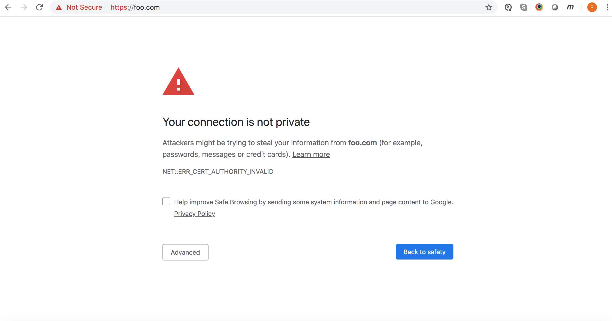
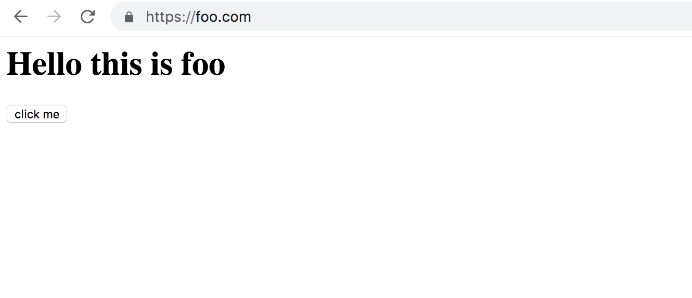

# Cors with Authentication and HTTPS

## Setting up HTTPS

In order to be as realistic as possible, I want to have https enabled on all my sites.
Since I don't want to have to buy a real certificate, I will self sign my certificates.

I am going to use the OpenSSL tool for creating certificates. Whilst this is the industry standard tool for creating and managing certificates, it isn't the most user friendly piece of software around. The documentation also leaves a lot to be desired.

I will be using an Apache server running locally on my Macbook Pro.

There are 3 basic steps to create a certificate. First, we have to create a private key, then we create certificate request, and finally we create the certificate itself.
In practise these can be combined in a single command:

```
  openssl req -config foo.conf -new -x509 -days 365 -out foo.crt
```

Here is our configuration file `foo.conf`:

```
[ req ]
default_bits = 2048
default_keyfile = foo.key
default_md = sha256
distinguished_name = subject
x509_extensions = x509_ext
encrypt_key = no
prompt = no

[ subject ]
countryName = GB 
stateOrProvinceName = England
localityName = London
organizationName = foo
commonName = foo.com
emailAddress = rich@foo.com 

[ x509_ext ]
subjectAltName = @alternate_names

[ alternate_names ]
DNS.1 = foo.com
```

We can view the contents of our new certificate with the command:

```
openssl x509 -in foo.crt -text
```
Now we install the certificate on our server

```
<VirtualHost *:443>
   ServerName foo.com
   DocumentRoot "/Users/richardhunter/development/cors-experiment/foo"
   ErrorLog "/private/var/log/apache2/foo-error-log"
   CustomLog "/private/var/log/apache2/foo-access-log" common
   SSLEngine on
   SSLCertificateFile "/Users/richardhunter/development/cors-experiment/certificates/foo/foo.crt"
   SSLCertificateKeyFile "/Users/richardhunter/development/cors-experiment/certificates/foo/foo.key"
</VirtualHost>
```
And restart Apache `sudo apachectl restart`

Now when we navigate to the page in Chrome we get the following message:



Firefox and Safari show similar messages

What we need to do is tell Macs Keychain that this certificate is allowed:

```
sudo security \
    add-trusted-cert \
    -d \
    -k /Library/Keychains/System.keychain \
    /Users/richardhunter/development/cors-experiment/certificates/foo/foo.crt
```

And now our page works!

 
..Or that is to say, it works on Chrome (and on Safari). For some reason, Firefox still doesn't like it.
We get the same message as before.

## Setting up authentication with Apache

This is the Apache configuration to provide Basic authentication for the foo folder.

```
  <Directory "/Users/richardhunter/development/cors-experiment/foo">
      AuthType Basic                       
      AuthName "Restricted Files"          
      AuthBasicProvider file               
      AuthUserFile "/Users/richardhunter/development/cors-passwords"
      Require user richard 
  </Directory> 

```

Attempting to access the file `/foo.com/test.json` results in being challenged for a username and password pair on all three browsers. On entering these credentials, the user is granted access in all cases.

## Creating a Root Certificate


###  Step 1: Create a private key
```
  openssl genrsa -des3 -out richardhunter.key 2048
```

#### Explanation of command

* `genrsa`  generates an RSA private key
* `-des3` encrypts the private key with the Triple Data Encryption Algorithm. Will prompt for a password (if `-passout`) argument not supplied  
* `-out richardhunter.key` writes output to the specified file
* `2048`  size of private key in bits. 2048 is actually the default so shouldn't be necessary here?

### Step 2: Create  the root certificate
```
  openssl req -x509 -new -nodes -key richardhunter.key -sha256 -days 1825 -out richardhunter.pem
```

#### Explanation of command

* `req` for creating certificate requests but can also be used to create self signed certificates for use as root CAs
* `-x509` outputs a self signed certificate instead of a certificate request
* `-new` generates a new certificate request (possibly not necessary here?)
* `-nodes` If a private key is created, it will not be encrypted (not sure this is necessary either since we've already created a private key and it IS encryped!)
* `-key richardhunter.key` uses specified private key
* `-sha256` message digest to sign the request with
* `-days 1825` number of days the certificate will be valid for
* `-out richardhunter.pem` writes output to the specified file


### Sources
* [How to Create Your Own SSL Certificate Authority for Local HTTPS Development - deliciousbrains.com](https://deliciousbrains.com/ssl-certificate-authority-for-local-https-development/)
* [openssl documention](https://www.openssl.org/docs/man1.1.1/)
