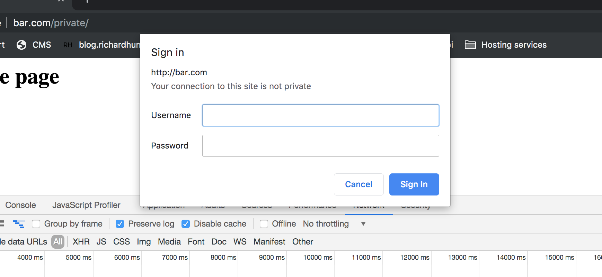
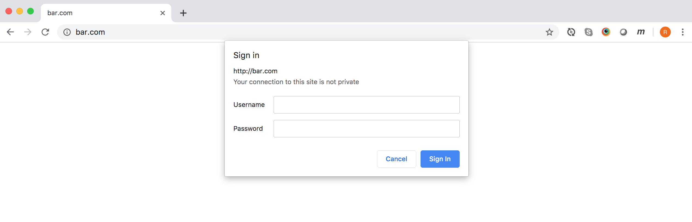

# Using CORS with authentication

As a front-end developer, I've long been familiar with making Ajax calls using first the XMLHttpRequest object and then later the Fetch API.
Whenever reading the documentation for these in MDN (and other places) I've always been slightly perplexed by the meaning of *credentials* which live on the XHR object as `withCredentials` and on the Request object as `credentials`. Although I have used Cors from time to time, I never had cause to use these properties and, in truth, it's a little unclear what exactly they are for. The documentation isn't that helpful. For example, in the MDN documentation for credentials: 

> The credentials read-only property of the Request interface indicates whether the user agent should send cookies from the other domain in the case of cross-origin requests.

If all it does is send cookies along, why do we use the term **with-credentials**? Why not **with-cookies**? In fact, the same page somewhat qualifies what it means by credentials (I say 'somewhat'): 

> cookies, basic http auth, etc.

Hmm, not so good!

I looked in vain for a really good explanation as to what exactly credentials were in the context of Ajax requests and CORS, so I decided to investigate myself.


At this point I should say that it wasn't the case that I was completely baffled and had no idea whatsoever what credentials were for. It's fairly obvious what the general concept of them probably is, but probably isn't good enough in computer science. I wanted absolute certainity! I can't promise in this article that I have achieved this, and there are some areas where I still am not sure about things (I will point these out), but I hope I have made some progress to elucidating the situation.

# Setting up Apache server

###  Environment
I'm running on a Mac and will be using Apache server 2.4. 
Unless otherwise stated, I am testing in Chrome.

## Create a new webpage locally to test on

I started by creating a new domain to run on my local machine.
In `/etc/hosts`, I mapped this domain to my local loopback address. Now, when I type `foo.com` into my address bar, my computer will go to local host rather than out into the internet for this page.

```
  127.0.0.1 foo.com 
```
For this to work, of course, something has to be running at local host. I use Apache as a server and I have it configured to used virtual name based hosts.
This is the configuration that makes Apache go to the `/foo` directory to fetch a file when the user visits my new domain.

```
  <VirtualHost *:80>
      ServerName foo.com
      DocumentRoot "/Users/richardhunter/development/cors-experiment/foo"
      ErrorLog "/private/var/log/apache2/foo.com-error_log"
      CustomLog "/private/var/log/apache2/foo.com-access_log" common
  </VirtualHost>

```

Check this works. 


Hooray! 


## Using CORS 

Having created a domain, we have to now create another one so that we can make XHR requests to it in order to demonstrate CORS. We go through identical steps to those above except our new domain will be called `bar.com`


When we attempt from the `foo.com` domain to make a request cross-origin to bar.com for `test.json` that the request fails and we get the following error in the console:

> Access to fetch at 'http://bar.com/test.json' from origin 'http://foo.com' has been blocked by CORS policy: No 'Access-Control-Allow-Origin' header is present on the requested resource. If an opaque response serves your needs, set the request's mode to 'no-cors' to fetch the resource with CORS disabled.


To create this password file: 

```
  htpasswd -c ~/development/cors-passwords richard

```
(note to self: password is 'password')


Now when you visit the page `http://foo.com`, you will be first asked to enter your username and password before being allowed to proceed to the page.

On subsequent visits, the browser remembers your credentials and you wont have to re-enter these details.




In Apache virtual hosts config file, create VirtualHost directives to point Apache at foo and bar folders when browser navigates to these domains.

```
  <VirtualHost *:80>
      ServerName foo.com
      DocumentRoot "/Users/richardhunter/development/cors-experiment/foo"
      ErrorLog "/private/var/log/apache2/foo.com-error_log"
      CustomLog "/private/var/log/apache2/foo.com-access_log" common
      <Directory "/Users/richardhunter/development/cors-experiment/foo">
          Options Indexes FollowSymLinks
          AllowOverride All
          Order allow,deny
          Allow from all
      </Directory>
  </VirtualHost>
 
  <VirtualHost *:80>
      ServerName bar.com
       DocumentRoot "/Users/richardhunter/development/cors-experiment/bar"
       ErrorLog "/private/var/log/apache2/bar.com-error_log"
       CustomLog "/private/var/log/apache2/bar.com-access_log" common
       <Directory "/Users/richardhunter/development/cors-experiment/bar">
           Options Indexes FollowSymLinks
           AllowOverride All
           Order allow,deny
           Allow from all
       </Directory>
  </VirtualHost>

```

Make XHR request from `foo.com` to `bar.com`.

This fails with the following error shown in the browser.

> Access to fetch at 'http://bar.com/test.json' from origin 'http://foo.com' has been blocked by CORS policy: No 'Access-Control-Allow-Origin' header is present on the requested resource. If an opaque response serves your needs, set the request's mode to 'no-cors' to fetch the resource with CORS disabled.


We can fix this by making requests bar.com return the Access-Control-Allow-Origin header set to '&ast;'
.

```
<VirtualHost *:80>
    ServerName bar.com
    DocumentRoot "/Users/richardhunter/development/cors-experiment/bar"
    ErrorLog "/private/var/log/apache2/bar.com-error_log"
    CustomLog "/private/var/log/apache2/bar.com-access_log" common
    Header set Access-Control-Allow-Origin "*"  
</VirtualHost>
```


## Authentication

How will this work when `bar.com` is password protected? To find out, lets make it password protected.


```
  <VirtualHost *:80>
      ServerName bar.com
      DocumentRoot "/Users/richardhunter/development/cors-experiment/bar"
      ErrorLog "/private/var/log/apache2/bar.com-error_log"
      CustomLog "/private/var/log/apache2/bar.com-access_log" common
      Header set Access-Control-Allow-Origin "*"  
      <Directory /Users/richardhunter/development/cors-experiment/bar>
        AuthType Basic
        AuthName "Restricted Files"
        AuthBasicProvider file
        AuthUserFile "/Users/richardhunter/development/cors-passwords"
        Require user richard
      </Directory>
  </VirtualHost>
```
`AuthUserFile` references a file containing passwords.
It is created using the `htpasswd` utility that is installed with Apache:
```
  htpasswd -c ~/development/cors-passwords richard

```
The `-c` flag means to create a new file. If we omit that, we will simply add the user to an existing file.

Once I visit `bar.com`, I find that I am greeted with a pop up asking me to input my username and password.



An interesting observation is that if you refresh the page, or go to a page within the same folder, you aren't rechallenged. The browser remembers your username and password (or your 'credentials'). 
Forcing the browser to clear these credentials is a bit unclear. Opening and closing the browser(Chrome) doesn't automatically work. Closing the browser then opening in an incognito window seems to work, but I haven't worked out any definite rule.

## Cross domain requests requiring authentication

When we attempt to access the json file on bar.com from foo.com, we now find that our request fails. We receive a 401 unauthorised status code
Curiously we get the same error message in the console as before:

> Access to fetch at 'http://bar.com/test.json' from origin 'http://foo.com' has been blocked by CORS policy: No 'Access-Control-Allow-Origin' header is present on the requested resource. If an opaque response serves your needs, set the request's mode to 'no-cors' to fetch the resource with CORS disabled.

Before, when we didn't return a `Access-Control-Allow-Origin` header, we received a 200 OK response although we didn't receive the data either.
It seems odd the the browser would show this rather misleading message, but that's what happens. It is things like this that, on top of the patchy documentation, cause a lot of misunderstanding around Cors.


The next step is to configure our request to send 'credentials'.
```
  const options = {
    credentials: 'include',
  };

  fetch(url, options).then(success, error);
```

We also have to edit the response headers a little bit. Firstly changing the `Access-Control-Allow-Origin` header to specifically point to our `foo.com` domain.
Secondly, adding the `Access-Control-Allow-Credentials` header
```

    Header set Access-Control-Allow-Origin "http://foo.com"  
    Header set Access-Control-Allow-Credentials true
```

Now, everything should work. We should be able to make an Ajax request to `bar.com` from `foo.com` and receive a successful response with data.

## Issues
In Chrome devtools, only provisional headers are shown, even though the data returns. This issue does not occur in Firefox.

## CORS with images
There is also a `crossorigin` attribute that can be applied to images. This is primarily for images used with the canvas API. The issues are explained in the [CORS enabled image page on MDN](https://developer.mozilla.org/en-US/docs/Web/HTML/CORS_enabled_image)
