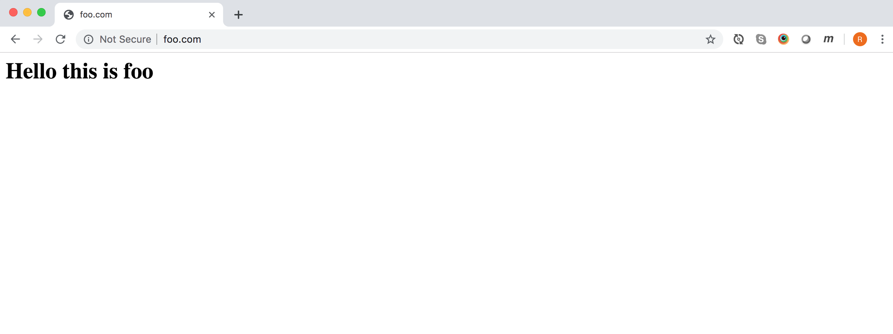

# Using CORS with authentication

As a front-end developer, I've long been familiar with making Ajax calls using first the XMLHttpRequest object and then later the Fetch API.
Whenever reading the documentation for these in MDN (and other places) I've always been slightly perplexed by the meaning of *credentials* which live on the XHR object as `withCredentials` and on the Request object as `credentials`. Although I have used Cors from time to time, I never had cause to use these properties and, in truth, it's a little unclear what exactly they are for. The documentation isn't that helpful. For example, in the MDN documentation for credentials: 

As a front-end developer I've long been familiar with making Ajax calls using both the XHR object and the Fetch API, and with using CORS, but I've always been a bit sketchy about the meaning of **credentials** which crop up within much of the documentation that I've read. The XHR object has the `withCredentials` property, whilst the corresponding `credentials` property can be found on the Request object of the Fetch API. The documentation in MDN says this about it:
> The credentials read-only property of the Request interface indicates whether the user agent should send cookies from the other domain in the case of cross-origin requests.

This might reasonably make one wonder why it isn't then called **withCookies**? In fairness, the documentation goes onto clarify that it is not just cookies that are sent along but "cookies, basic http auth, etc.". Hmm.
A bit more digging in various places expands on this and it turns out that the idea is indeed that when a browser makes a cross-origin request with credentials set then the browser should pass whatever data it has relating to authentication on that site that would allow the user to log on.
To be clear, this can be in the form of cookies, Authentication headers, or TLS certificates.

For my own learning, I decided to try and write an app that would demo all this, and this is the subject of this article.


# Set up
My local machine is a Macbook Pro running <operating system>.
I'm going to use Apache 2.4 as a web server.
Unless otherwise stating, I'm using Chrome<version> for testing.

Although precise details of using Apache are outside the scope of this article, I will try and give as much details regarding my configuration as I can. 
All the code can be found in the Github repository.

##  Creating a new domain
To create a new domain that will run on local host, the first step is to map a hostname (arbitrarily chosen) to the local loopback address in the hosts file.
On my system, this is found at `/etc/hosts'.

```
  #  hosts file
  127.0.0.1 foo.com 
```

Now when I visit `foo.com` in my browser, my computer will go to localhost for the page rather than out to the internet.
For this to work, of course, something has to be running at local host.
I configured a new virtual host in my Apache configuration file to point to a location on my local machine.
The browser will now serve up any requests for `foo.com` out of the `/Users/richardhunter/development/cors-experiment/foo` directory.

```
  <VirtualHost *:80>
      ServerName foo.com
      DocumentRoot "/Users/richardhunter/development/cors-experiment/foo"
      ErrorLog "/private/var/log/apache2/foo.com-error_log"
      CustomLog "/private/var/log/apache2/foo.com-access_log" common
  </VirtualHost>

```

And this works - hooray! We now have a webpage we can experiment with.




## Using CORS 

Having created a domain, we have to now create another one so that we can make XHR requests to it in order to demonstrate CORS. We go through identical steps to those above except our new domain will be called `bar.com`


When we attempt from the `foo.com` domain to make a request cross-origin to bar.com for `test.json` that the request fails and we get the following error in the console:

> Access to fetch at 'http://bar.com/test.json' from origin 'http://foo.com' has been blocked by CORS policy: No 'Access-Control-Allow-Origin' header is present on the requested resource. If an opaque response serves your needs, set the request's mode to 'no-cors' to fetch the resource with CORS disabled.


We can fix this by making requests bar.com return the Access-Control-Allow-Origin header set to `&ast;`.


```
<VirtualHost *:80>
    ServerName bar.com
    DocumentRoot "/Users/richardhunter/development/cors-experiment/bar"
    ErrorLog "/private/var/log/apache2/bar.com-error_log"
    CustomLog "/private/var/log/apache2/bar.com-access_log" common
    Header set Access-Control-Allow-Origin "*"  
</VirtualHost>
```

## With Cookies?
So what I wondered at this point was whether setting credentials on the request would result in cookies being sent to the other domain? First I had to make `bar.com` set some cookies that could be sent back in a response.
Just for good measure, I also set a cookie on `foo.com`. It was important to show that this cookie would not be passed through to `bar.com`. I didn't expect it to, but I thought it was worth being sure!

## Authentication

How will this work when `bar.com` is password protected? To find out, lets make it password protected.


```
  <VirtualHost *:80>
      ServerName bar.com
      DocumentRoot "/Users/richardhunter/development/cors-experiment/bar"
      ErrorLog "/private/var/log/apache2/bar.com-error_log"
      CustomLog "/private/var/log/apache2/bar.com-access_log" common
      Header set Access-Control-Allow-Origin "*"  
      <Directory /Users/richardhunter/development/cors-experiment/bar>
        AuthType Basic
        AuthName "Restricted Files"
        AuthBasicProvider file
        AuthUserFile "/Users/richardhunter/development/cors-passwords"
        Require user richard
      </Directory>
  </VirtualHost>
```
`AuthUserFile` references a file containing passwords.
It is created using the `htpasswd` utility that is installed with Apache:
```
  htpasswd -c ~/development/cors-passwords richard

```
The `-c` flag means to create a new file. If we omit that, we will simply add the user to an existing file.

Once I visit `bar.com`, I find that I am greeted with a pop up asking me to input my username and password.


An interesting observation is that if you refresh the page, or go to a page within the same folder, you aren't rechallenged. The browser remembers your username and password (or your 'credentials'). 
Forcing the browser to clear these credentials is a bit unclear. Opening and closing the browser(Chrome) doesn't automatically work. Closing the browser then opening in an incognito window seems to work, but I haven't worked out any definite rule.

## Cross domain requests requiring authentication

When we attempt to access the json file on bar.com from foo.com, we now find that our request fails. We receive a 401 unauthorised status code
Curiously we get the same error message in the console as before:

> Access to fetch at 'http://bar.com/test.json' from origin 'http://foo.com' has been blocked by CORS policy: No 'Access-Control-Allow-Origin' header is present on the requested resource. If an opaque response serves your needs, set the request's mode to 'no-cors' to fetch the resource with CORS disabled.

Before, when we didn't return a `Access-Control-Allow-Origin` header, we received a 200 OK response although we didn't receive the data either.
It seems odd the the browser would show this rather misleading message, but that's what happens. It is things like this that, on top of the patchy documentation, cause a lot of misunderstanding around Cors.


The next step is to configure our request to send 'credentials'.
```
  const options = {
    credentials: 'include',
  };

  fetch(url, options).then(success, error);
```

We also have to edit the response headers a little bit. Firstly changing the `Access-Control-Allow-Origin` header to specifically point to our `foo.com` domain.
Secondly, adding the `Access-Control-Allow-Credentials` header
```

    Header set Access-Control-Allow-Origin "http://foo.com"  
    Header set Access-Control-Allow-Credentials true
```

Now, everything should work. We should be able to make an Ajax request to `bar.com` from `foo.com` and receive a successful response with data.

## Issues
In Chrome devtools, only provisional headers are shown, even though the data returns. This issue does not occur in Firefox.

## CORS with images
There is also a `crossorigin` attribute that can be applied to images. This is primarily for images used with the canvas API. The issues are explained in the [CORS enabled image page on MDN](https://developer.mozilla.org/en-US/docs/Web/HTML/CORS_enabled_image)


Tests

Config
Cors enabled: yes | no
with credentials: include | same-origin | omit  (default is same-origin) 
authentication: yes | no

1.
Ajax request same origin with authentication enabled
cors enabled: no
authentication: yes

2. 
Ajax request cross-origin

cors enabled: yes
with credentials: include
authentication: no

3. 
Ajax request cross origin to host with authentication enabled

cors enabled: yes
with credentials: include
authentication: yes 

4.
Ajax request cross origin to host with authentication enabled
cors enabled: yes
with credentials: same-origin 
authentication: yes 

5.
cors enabled: yes
with credentials: same-origin 
authentication: no 

6.
cors enabled: yes
with credentials: omit 
authentication: yes 

7.
cors enabled: yes
with credentials: omit 
authentication: no 


What to test?

When we make a cross-origin request - 
1. Is Set-Cookie header in response?
2. Is cookie header in request
3. What is status code?
4. Is data returned?
5. Is there a message in console. If so, what is it?
6. Are we challenged for a username/password?


### Firefox
3. 
* cors enabled: yes
* with credentials: include
* authentication: yes 

#### Clearing credentials
* After a certain interval (maybe half an hour), Firefox seems to erase credentials.
* clearing history does NOT work
* restarting FF does NOT work

### Chrome
3. 
* cors enabled: yes
* with credentials: include
* authentication: yes 

#### Clearing credentials
Closing and reopening Chrome on its own doesn't work.
However, closing and reopening - and then opening the developer tools DOES work.


Cors didn't work at all in Safari. I believe that was because I wasn't using https. I therefore installed a self-signed certificate on the server to allow the page to use TLS. however once I had done this, I discovered that both pages have to use https otherwise you get warnings about mixed content and the call does not work.

> (index):11 Mixed Content: The page at 'https://foo.com/' was loaded over HTTPS, but requested an insecure resource 'http://bar.com/test.json/'. This request has been blocked; the content must be served over HTTPS.


> Access to fetch at 'https://bar.com/test.json/' from origin 'https://foo.com' has been blocked by CORS policy: The 'Access-Control-Allow-Origin' header has a value 'http://foo.com/' that is not equal to the supplied origin. Have the server send the header with a valid value, or, if an opaque response serves your needs, set the request's mode to 'no-cors' to fetch the resource with CORS disabled.


Set up certificates on both sites yet still getting this error!
> Access to fetch at 'https://bar.com/test.json/' from origin 'https://foo.com' has been blocked by CORS policy: The 'Access-Control-Allow-Origin' header has a value 'https://foo.com/' that is not equal to the supplied origin. Have the server send the header with a valid value, or, if an opaque response serves your needs, set the request's mode to 'no-cors' to fetch the resource with CORS disabled.


still not working on Safari!
Getting 401 error
