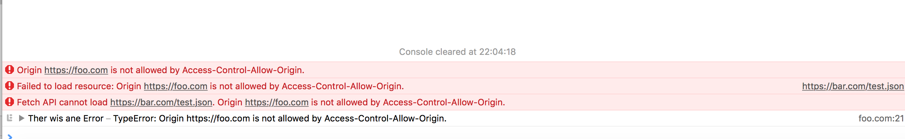

# Cors

Add these lines to the Apache config file for `bar.com` to allow cross origin requests from `foo.com`.
```
Header set Access-Control-Allow-Origin "https://foo.com"
Header set Access-Control-Allow-Credentials true
```

Authenticated pages do not seem to work cross origin in Safari. Here is the error message

